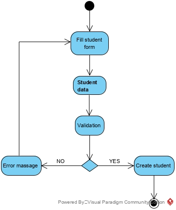
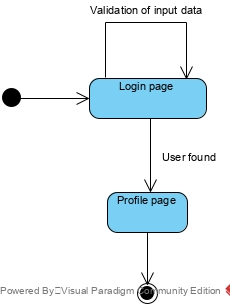

# UML Диаграммы
1. [Диаграмма прецедентов](#1) 
1.1 [Актёры](#1.1) 
1.2 [Варианты использования](#1.2) 
1.2.1 [Вход в систему](#1.2.1) 
1.2.2 [Просмотр расписания](#1.2.2) 
1.2.3 [Просмотр посещений](#1.2.3) 
1.2.4 [Отметка посещений](#1.2.4) 
1.2.5 [Создание студента](#1.2.5) 
1.2.6 [Создание профессора](#1.2.6) 
1.2.7 [Создание группы](#1.2.7) 
1.2.8 [Создание факультета](#1.2.8) 
1.2.9 [Удаление факультета](#1.2.9) 
1.2.10 [Создание занятия](#1.2.10) 
1.2.11 [CRUD большинства данных в DB](#1.2.11) 
2. [Диаграммы активности](#2) 
2.1 [Вход в систему](#2.1) 
2.2 [Просмотр расписания](#2.2) 
2.3 [Просмотр посещений](#2.3) 
2.4 [Отметка посещений](#2.4) 
2.5 [Создание студента](#2.5) 
2.6 [Создание профессора](#2.6) 
2.7 [Создание группы](#2.7) 
2.8 [Создание факультета](#2.8) 
2.9 [Удаление факультета](#2.9) 
2.10 [Создание занятия](#2.10) 
2.11 [CRUD большинства данных в DB](#2.11) 
3. [Диаграмма последовательности](#3)
4. [Диаграммы состояния](#4) 
4.1 [Авторизация в систему](#4.1) 
4.2 [Создание кошелька](#4.2) 
4.3 [Оформление подписки](#4.3) 
5. [Диаграмма классов](#5) 
6. [Совмещенная диаграмма компонентов и развертывания](#6) 

<a name="1"/>

### 1. Диаграмма прецедентов 
Диаграмма прецедентов представляет собой следующую диаграмму:

<a name="1.1"/>

#### 1.1 Актёры
Актёр | Описание
--- | ---
Посетитель|Человек, зашедший на сайт приложения, просмотр расписания недоступнен до входа в систему.
Студент|Человек, зарегистрированный в системе, использующий приложение для просмотра расписания и задолженностей.
Профессор|Человек, зарегистрированный в системе, использующий приложение для просмотра расписания. Также он может отмечать студентов.
Админ|Человек, зарегистрированный в системе, имеющий доступ к базе данных. Может делать все.

<a name="1.2"/>

#### 1.2 Варианты использования
Примечание: при указании повторения дествия, происходит повторение действия варианта использования, в котором оно возникло.

<a name="1.2.1"/>

##### 1.2.1 Вход в систему
**Описание.** Вариант использования "Вход в систему" позволяет посетителю авторизироваться в приложении.
Поток событий:
1. Посетитель переходит на сайт приложения.
2. Приложение переходит на страницу входа в систему.
3. Посетитель вводит "Email" и "Password".
4. Посетитель нажимает клавишу "Log in".
5. Приложение проверяет соответствие введенных данных с базой данных. При неверных данных приложение выводит сообщение об ошибке, посетитель повторяет действия 3 и 4.  
6. Приложение авторизирует посетителя, происходит переход на страницу профиля.
7. Конец.

<a name="1.2.2"/>

##### 1.2.2 Просмотр расписания
**Описание.** Вариант использования "Просмотр расписания" позволяет студенту и профессору просмотривать расписание занятий.
Поток событий:
1. Пользователь авторизируется в систему.
2. Приложение переходит на станицу просмотра расписания.
3. Конец.

<a name="1.2.3"/>

##### 1.2.3 Просмотр посещений
**Описание.** Вариант использования "Просмотр посещений" позволяет студенту просматривать пропуски занятий.
Поток событий:
1. Студент нажимает клавишу "Attedance" на панели инструментов.
2. Приложение переходит на станицу просмотра посещений.
3. Студент выбирает период времени для проверки посещений.
4. Студент нажимает кнопку "Result".
5. Приложение проверяет наличине задолженностей у данного студента.
6. Приложение выводит либо сообщение об отсутствии задолженностей, либо задолженности.
7. Конец.

<a name="1.2.4"/>

##### 1.2.4 Отметка посещений
**Описание.** Вариант использования "Отметка посещений" позволяет профессору отмечать посещение студентами занятий.
Поток событий:
1. Профессор нажимает клавишу "Attedance" на панели инструментов.
2. Приложение переходит на станицу посещений.
3. Профессор выбирает группу для отметки посещений.
4. Приложение показывает всех студентов данной группы.
5. Профессор нажимает напротив каждого студента либо "absent", либо "present".
6. Приложение заносит в базу данные о присутствии студента на занятии.
7. Конец.

<a name="1.2.5"/>

##### 1.2.5 Создание студента
**Описание.** Вариант использования "Создание студента" позволяет админу создать создать студента.
Поток событий:
1. Админ нажимает клавишу "Students" на панели инструментов.
2. Приложение переходит на страницу студентов.
3. Админ нажимает клавишу "Add student".
4. Админ вводит "First Name", "Last Name", "Email", "Password", "Group", "Address", "Birthday".
5. Админ нажимает клавишу "Create".
6. Приложение проверяет валидность данных. При неверных данных происходит повторение действия 4 и 5. 
7. Приложение создает студента с введенными данными.
8. Конец.

<a name="1.2.6"/>

##### 1.2.6 Создание профессора
**Описание.** Вариант использования "Создание профессора" позволяет админу создать профессора.
Поток событий:
1. Админ нажимает клавишу "Professors" на панели инструментов.
2. Приложение переходит на страницу профессоров.
3. Админ нажимает клавишу "Add professor".
4. Админ вводит "First Name", "Last Name", "Email", "Password", "Academic rank", "Field of Research", "Birthday".
5. Админ нажимает клавишу "Create".
6. Приложение проверяет валидность данных. При неверных данных происходит повторение действия 4 и 5. 
7. Приложение создает профессора с введенными данными.
8. Конец.

<a name="1.2.7"/>

##### 1.2.7 Создание группы
**Описание.** Вариант использования "Создание группы" позволяет админу создать группу.
Поток событий:
1. Админ нажимает клавишу "Groups" на панели инструментов.
2. Приложение переходит на страницу групп.
3. Админ нажимает клавишу "Add Group".
4. Админ вводит "Faculty", "Speciality", "Grade", "Graduation".
5. Админ нажимает клавишу "Create".
6. Приложение проверяет валидность данных. При неверных данных происходит повторение действия 4 и 5. 
7. Приложение создает группу с введенными данными.
8. Конец.

<a name="1.2.8"/>

##### 1.2.8 Создание факультета
**Описание.** Вариант использования "Создание факультета" позволяет админу создать факультет.
Поток событий:
1. Админ нажимает клавишу "Groups" на панели инструментов.
2. Приложение переходит на страницу групп.
3. Админ нажимает клавишу "Add/Delete Faculty".
4. В появившемся окне админ выбирает "Create"
5. Админ вводит "Faculty Name".
6. Админ нажимает клавишу "Create".
7. Приложение проверяет валидность данных. При неверных данных происходит повторение действия 4 и 5. 
8. Приложение создает группу с введенными данными.
9. Конец.

<a name="1.2.9"/>

##### 1.2.9 Удаление факультета
**Описание.** Вариант использования "Удаление факультета" позволяет админу удалить факультет.
Поток событий:
1. Админ нажимает клавишу "Groups" на панели инструментов.
2. Приложение переходит на страницу групп.
3. Админ нажимает клавишу "Add/Delete Faculty".
4. В появившемся окне админ выбирает "Delete".
5. Админ выбирает факультет из выпадающего списка.
6. Админ нажимает клавишу "Delete".
7. Приложение удаляет выбранный факультет.
8. Конец.

<a name="1.2.10"/>

##### 1.2.10 Создание занятия
**Описание.** Вариант использования "Создание занятия" позволяет админу создать занятие.
Поток событий:
1. Админ нажимает клавишу "Lessons" на панели инструментов.
2. Приложение переходит на страницу занятий.
3. Админ нажимает клавишу "Create Lesson".
4. Админ вводит "Lesson", "Professor", "Time", "Room", "Day", "Groups".
5. Админ нажимает клавишу "Create".
6. Приложение проверяет валидность данных. При неверных данных происходит повторение действия 4 и 5. 
7. Приложение создает занятие с введенными данными.
8. Конец.

<a name="1.2.11"/>

##### 1.2.11 CRUD большинства данных в DB

<a name="2"/>

### 2. Диаграммы активности

<a name="2.1"/> 

##### 2.1 Вход в систему
При заполнении форм данных происходит их валидация. При неверных данных выводится сообщение об ошибке с требованием повторить действие, иначе происходит авторизация и переход на страницу всех продуктов.

<a name="2.2"/>

##### 2.2 Просмотр расписания
Студент или преподаватель просматривает рассписание своей группы или преподавателей.

<a name="2.3"/>

##### 2.3 Просмотр посещений
Студент может посмотреть свои пропуски занятий.

<a name="2.4"/>

##### 2.4 Отметка посещений
Профессор может отметить посещение студентами своих занятих.

<a name="2.5"/>

##### 2.5 Создание студента
При заполнении форм данных происходит их валидация. При неверных данных выводится сообщение об ошибке с требованием повторить действие, иначе происходит создание студента.

<a name="2.6"/>

##### 2.6 Создание профессора
При заполнении форм данных происходит их валидация. При неверных данных выводится сообщение об ошибке с требованием повторить действие, иначе происходит создание профессора.

<a name="2.7"/>

##### 2.7 Создание группы
При заполнении форм данных происходит их валидация. При неверных данных выводится сообщение об ошибке с требованием повторить действие, иначе происходит создание группы.

<a name="2.8"/>

##### 2.8 Создание факультета
При заполнении форм данных происходит их валидация. При неверных данных выводится сообщение об ошибке с требованием повторить действие, иначе происходит создание факультета.

<a name="2.9"/>

##### 2.9 Удаление факультета
Админ может удалить факультет.

##### 2.10 Создание занятия
При заполнении форм данных происходит их валидация. При неверных данных выводится сообщение об ошибке с требованием повторить действие, иначе происходит создание занятия.

<a name="2.10"/>

##### 2.11 CRUD большинства данных в DB

<a name="3"/>
 
### 3. Диаграмма последовательности
Диаграмма последовательности основных вариантов использования представлена ниже:

<a name="4"/>

### 4. Диаграммы состояния

<a name="4.1"/>

##### 4.1 Авторизация в систему

<a name="4.2"/>

##### 4.2 Создание занятия

<a name="5"/>

### 5. Диаграмма классов

Схемы диаграммы классов разделена на уровни:
* Models - классы сущностей, используемых при взаимодействии с базой данных (класс соответсвует таблице в базе).
* Repositories - классы уровня Data Access. Используются для взаимодествия с базой данных.
* Services - классы, содержащие в себе всю бизнес логику приложения.
* Controllers - классы для обработки запросов с фронтенда и передачи ответа.

<a name="6"/>

### 6. Совмещенная диаграмма компонентов и развертывания 

