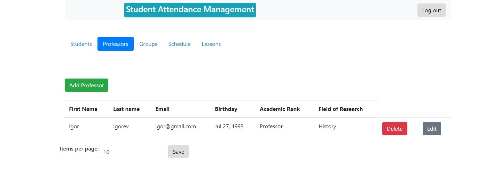
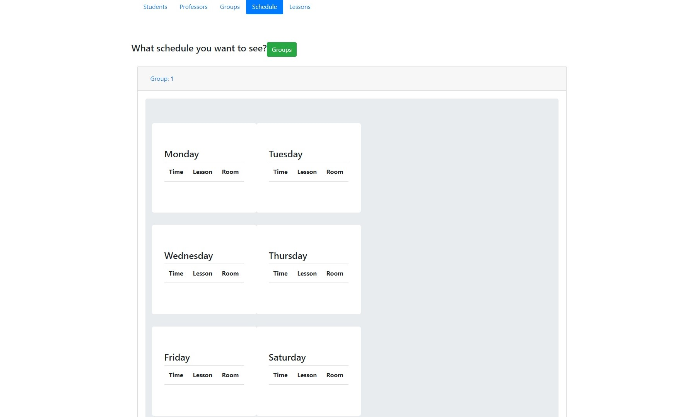
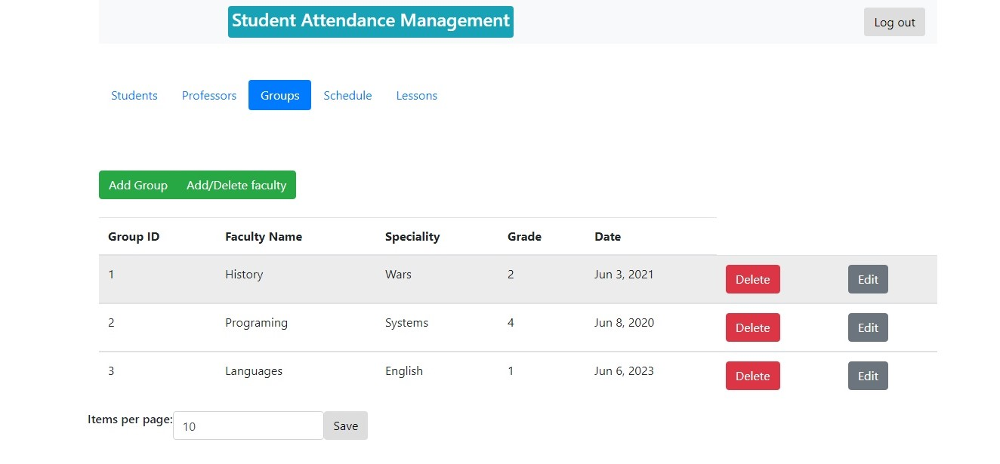

# Требования к проекту
---

## Содержание

1 [Введение](#intro)  
2 [Требования пользователя](#user_requirements)  
2.1 [Программные интерфейсы](#software_interfaces)  
2.2 [Интерфейс пользователя](#user_interface)  
2.3 [Характеристики пользователей](#user_specifications)  
2.3.1 [Классы пользователей](#user_classes)  
2.3.2 [Целевая аудитория приложения](#application_audience)  
2.4 [Предположения и зависимости](#assumptions_and_dependencies)  
3 [Системные требования](#system_requirements)  
3.1 [Функциональные требования](#functional_requirements)  
3.2 [Нефункциональные требования](#non-functional_requirements)  
3.2.1 [Атрибуты качества](#quality_attributes)  
3.2.1.1 [Требования к удобству использования](#requirements_for_ease_of_use)  
3.2.1.2 [Требования к безопасности](#security_requirements)  
3.2.2 [Ограничения](#limitations)  
4 [Аналоги](#analogues)   

<a name="intro"/>

# 1 Введение
ISchedule - web приложение, позволяющее пользователям различных ролей(студент, преподаватель) просматривать свое расписание. Данное приложение имеет основные функции приложения "Рассписание", а также реализует защиту пользовательских данных от злоумышленников.

<a name="user_requirements"/>

# 2 Требования пользователя

<a name="software_interfaces"/>

## 2.1 Программные интерфейсы
1. Пользовательский интерфейс будет реализован с помощью Angular Framework
2. Бекенд будет реализован на языке Java при помощи Spring Framework.
3. Для хранения данных будет использована свободная реляционная система управления базами данных MySQL.

<a name="user_interface"/>

## 2.2 Интерфейс пользователя
Страница входа в систему.
  
Страница просмотра информации о студентах.
  
Страница просмотра информации о преподавателях.
  
Страница просмотра расписания.  
  
Страница просмотра информации о группах.
  
Страница просмотра информации о занятиях.  
  

<a name="user_specifications"/>

## 2.3 Характеристики пользователей

<a name="user_classes"/>

### 2.3.1 Классы пользователей

* Admin - может делать всё.
* Student - может просматривать свое расписание и задолженности.
* Professor - имеет возможность просматирвать свое расписание, устранять задолженности студентов.

<a name="application_audience"/>

### 2.3.2 Целевая аудитория приложения

* Студенты университетов.
* Профессора, преподаватели.

<a name="assumptions_and_dependencies"/>

## 2.4 Предположения и зависимости
Приложение не работает при отсутствии подключения к Интернету.

<a name="system_requirements"/>

# 3 Системные требования

<a name="functional_requirements"/>

## 3.1 Функциональные требования

Пользователю предоставлены возможности:

| Функция | Требования | 
|:---|:---|
| Вход в систему | При переходе по ссылке приложения без авторизации на отдельной web-странице странице при валидных введенных данных должен выполниться вход в систему. |
| Просмотр расписания | Приложение должно показывать расписание доступное данному пользователю. |
| Просмотр задолженностей | Приложение должно отображать текущие задолженности пользователя, если они имеются. |
| Погашение задолженностей | Приложение позволяет удалить задолженность конкретного студента по необходимости. |

<a name="non-functional_requirements"/>

## 3.2 Нефункциональные требования

<a name="quality_attributes"/>

### 3.2.1 Атрибуты качества

<a name="requirements_for_ease_of_use"/>

#### 3.2.1.1 Требования к удобству использования
1. Понятный и простой интерфейс;
2. Для более удобного просмотра продуктов реализовать пагинацию.;
3. Разделение рассписания по неделям.

<a name="security_requirements"/>

#### 3.2.1.2 Требования к безопасности
1. Admin имеет доступ к базе данных.
2. При регистрации пароль пользователя кодируется.

<a name="limitations"/>

### 3.2.2 Ограничения 
* Приложение реализовано на языке Java.
* Приложение доступно для браузера GoogleChrome версии не ниже 3.29, для остальных браузеров ограничений нет.

<a name="analogues"/>

### 4. Аналоги 
Аналогами являются различные приложения для просмотра расписания. Для примера можно взять приложение БГУИРа [iis.bsuir.by/schedule](https://iis.bsuir.by/schedule). 